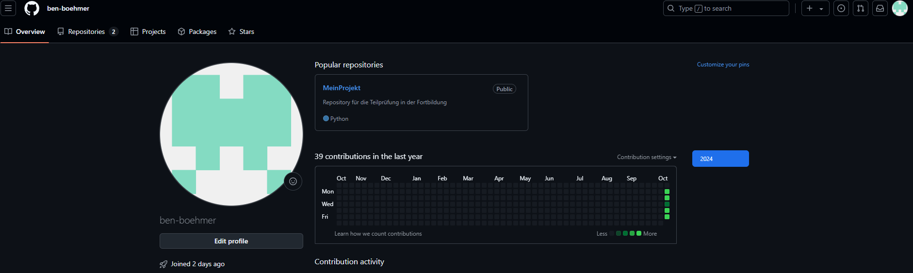
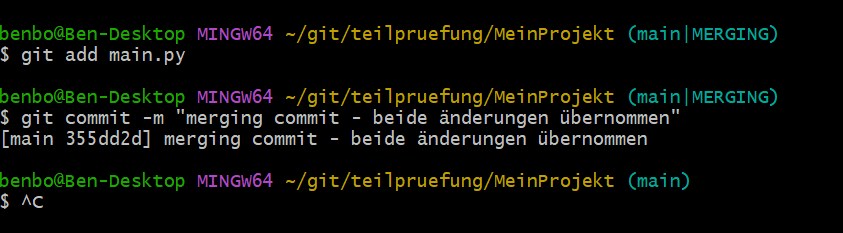

# Anlegen des Repositorys:

Adresse für das Repository: [https://github.com/ben-boehmer/MeinProjekt](https://github.com/ben-boehmer/MeinProjekt)

# Die Schritte, die du zum Erstellen eines SSH-Schlüssels (falls du keinen bereits hattest) durchgeführt hast.

Ich habe mit
    ssh-keygen -t rsa -b 4096 -C benboehmer@web.de
Keys angelegt, aber nach einer Recherche fand ich, dass es eine aktuellere Variante zur Erzeugung der
Schlüssel gibt, die ich dann benutzt habe:
    ssh-keygen -t ed25519 -C "benboehmer@web.de"
Dieser Vorgang hat die Schlüssel "id_ed25519" und "id_ed25519.pub" erzeugt im ~/.shh erzeugt:

# Die Schritte, die du zum lokalen Klonen des Repositorys, zum Konfigurieren von Git und zum Erstellen der initialen Commits durchgeführt hast.

    git clone git@github.com:ben-boehmer/MeinProjekt.git
    

	cd MeinProjekt

    git config user.name "Ben Boehmer"

    git config user.email "benboehmer@web.de"

# Die Schritte, die du zum Erstellen des "feature"-Branches, zum Hinzufügen einer neuen Datei zu diesem Branch und zum Committen der Änderungen durchgeführt hast.

    git checkout -b feature
    echo "print('Im feauture Zweig hinzugefuegt')" >> main.py
    git add main.py
    mkdir -p utils
    echo "print('Ich bin ein Feature')" > utils/database.py
    git add utils/database.py
    git commit -m "Neue Funktion hinzugefuegt"

# Die Schritte, die du zum Mergen des "feature"-Branches in den "master"-Branch und zum Beheben des dabei auftretenden Merge-Konflikts durchgeführt hast.

	git checkout master
	echo "print('Im Master Branch hinzugefuegt')" >> main.py
	git add main.py
	git commit -m "Hauptdatei aktualisiert"

	git add main.py

	git commit -m "merging commit - beide änderungen übernommen"  

    git merge feature
    

Hier ist ein Konflikt, da sowohl im *Feature* Branch die Datei *main.py* verändert wurde, als auch im *Main* Branch. Im *Main* Branch wurde die Zeile "print('Im Main Branch hinzugefuegt')" hinzugefügt und im *Feature* Branch wurde die Zeile "print('Im feature Zweig hinzugefuegt)".     

Da es bei diesem Beispiel nicht ersichtlich ist, was genau die beste Lösung ist, habe ich mich dafür entschieden beide Änderungen zu übernehmen sodass der Inhalt der *main.py* Datei so aussah:

Ein Aufruf des Status Befehls gab Auskunft, dass nun nachdem der Konflikt per Hand in der Datei aufgehoben wurde, diese Datei wieder neu wieder dem Staging hinzugefügt werden musste:

Dies und das letztendlich committen dieser Änderung wurde durch die Befehle

    git add main.py
    git commit -m "merging commit - beide änderungen übernommen"

durchgeführt.

# Update des Online Repositories:

Verbinden mit GitHub als remote Repository:

    git remote add origin https://github.com/ben-boehmer/MeinProjekt.git

# Update des Online Repositories:

    git push --set-upstream origin master
