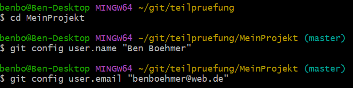

# Anlegen des Repositorys:

Adresse für das Repository: [https://github.com/ben-boehmer/MeinProjekt](https://github.com/ben-boehmer/MeinProjekt)

# Die Schritte, die du zum Erstellen eines SSH-Schlüssels (falls du keinen bereits hattest) durchgeführt hast.

Ich habe mit

    ssh-keygen -t rsa -b 4096 -C benboehmer@web.de

Keys angelegt, aber nach einer Recherche fand ich, dass es eine aktuellere Variante zur Erzeugung der
Schlüssel gibt, die ich dann benutzt habe:

    ssh-keygen -t ed25519 -C "benboehmer@web.de"
    
Dieser Vorgang hat die Schlüssel "id_ed25519" und "id_ed25519.pub" erzeugt im ~/.shh erzeugt:

Unter **Profil** und dann unter **SSH and GPG keys** wurde mit dem Button **New SSH key**
mein SSH Schlüssel hinzugefügt. Aus Bequemlichkeit habe ich kein Passwort vergeben,
was ich aber bei richtigen Repositorys nie machen würde und nachdem alles funktioniert
auch von mir geändert wird.

# Die Schritte, die du zum lokalen Klonen des Repositorys, zum Konfigurieren von Git und zum Erstellen der initialen Commits durchgeführt hast.

    git clone git@github.com:ben-boehmer/MeinProjekt.git
    

    cd MeinProjekt

    git config user.name "Ben Boehmer"

    git config user.email "benboehmer@web.de"

Anmerkung: Seit gewisser Zeit vergibt GitHub den Namen des Hauptbranches als
**main** und nicht mehr Master. Ich habe deshalb mit dem Befehl

    git branch -m master

den Branch umbenannt. 

# Die Schritte, die du zum Erstellen des "feature"-Branches, zum Hinzufügen einer neuen Datei zu diesem Branch und zum Committen der Änderungen durchgeführt hast.

**WICHTIG** - Es wurde hier, wie mit Alexander Redmann kommuniziert wurde, ein Schritt **14a. Bearbeite die Datei "main.py" und führe einen Commit auf dem feature Branch durch**
hinzugefügt, da sonst kein Merge-Konflikt entstanden wäre. 

Erschaffung und Wechseln zum neuen Branch *feature*

    git checkout -b feature

Hier wird der "main.py" Datei hinten eine Zeile angehängt:

    echo "print('Im feauture Zweig hinzugefuegt')" >> main.py
    git add main.py

Legt ein Verschnis *util* im Arbeitsverzeichnis an und erzeugt dort die Datei
*database.py* an. Diese wird dem Staging zugeführt und zusammen committet.

    mkdir -p utils
    echo "print('Ich bin ein Feature')" > utils/database.py
    git add utils/database.py
    git commit -m "Neue Funktion hinzugefuegt"

# Die Schritte, die du zum Mergen des "feature"-Branches in den "master"-Branch und zum Beheben des dabei auftretenden Merge-Konflikts durchgeführt hast.

Wechseln zum Branch master:

	git checkout master

Modifizieren der *main.py* Datei mit stating und commit:

    echo "print('Im Master Branch hinzugefuegt')" >> main.py
    git add main.py
    git commit -m "Hauptdatei aktualisiert"

#### Versuch des Merges des Feature Branchs auf den Master Branch:

    git merge feature

Es entsteht ein Konflikt, da in beiden Branches die Datei *main.py* verändert wurde:

Hier ist ein Konflikt, da sowohl im *Feature* Branch die Datei *main.py* verändert wurde, als auch im *Main* Branch. Im *Main* Branch wurde die Zeile "print('Im Main Branch hinzugefuegt')" hinzugefügt und im *Feature* Branch wurde die Zeile "print('Im feature Zweig hinzugefuegt)".

Da es bei diesem Beispiel nicht ersichtlich ist, was genau die beste Lösung ist, habe ich mich dafür entschieden beide Änderungen zu übernehmen sodass der Inhalt der *main.py* Datei so aussah:

Ein Aufruf des Status Befehls gab Auskunft, dass nun nachdem der Konflikt per Hand in der Datei aufgehoben wurde, diese Datei wieder neu wieder dem Staging hinzugefügt werden musste:

Dies und das letztendlich committen dieser Änderung wurde durch die Befehle

    git add main.py
    git commit -m "merging commit - beide änderungen übernommen"

durchgeführt.

# Update des Online Repositories:

Letztenlich wurden noch alle Veränderungen im GitHub repository übernommen,
dafür wurde es erst als remote repository angelegt:

    git remote add origin https://github.com/ben-boehmer/MeinProjekt.git

# Update des Online Repositories:

Und letztendlich auf den Server "gepusht":

    git push --set-upstream origin master
